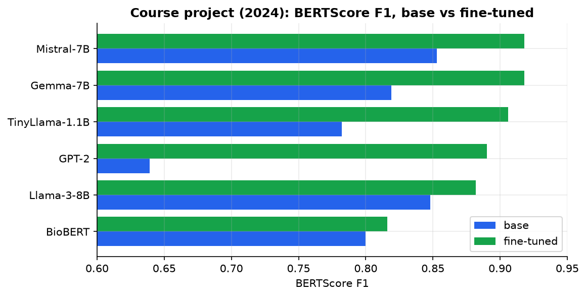
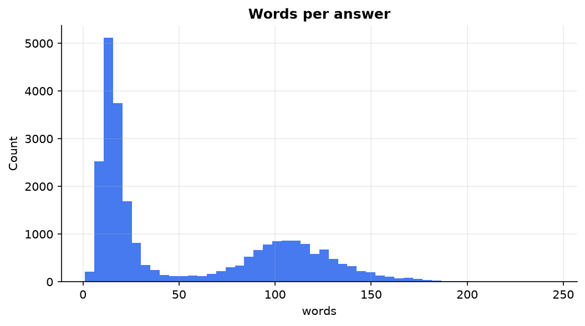
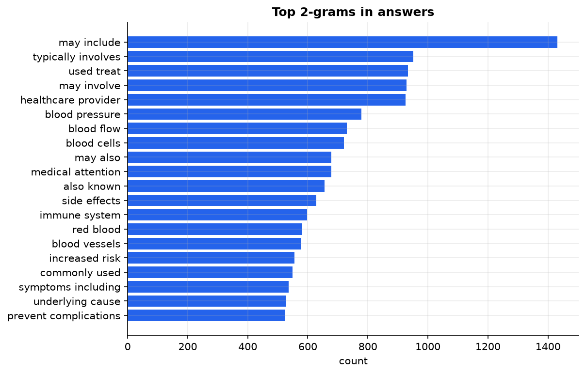
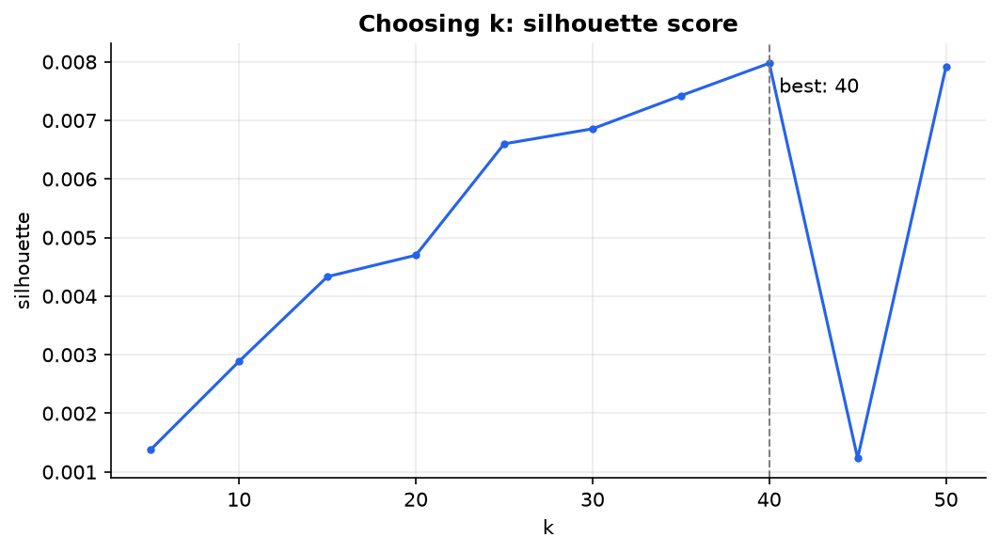
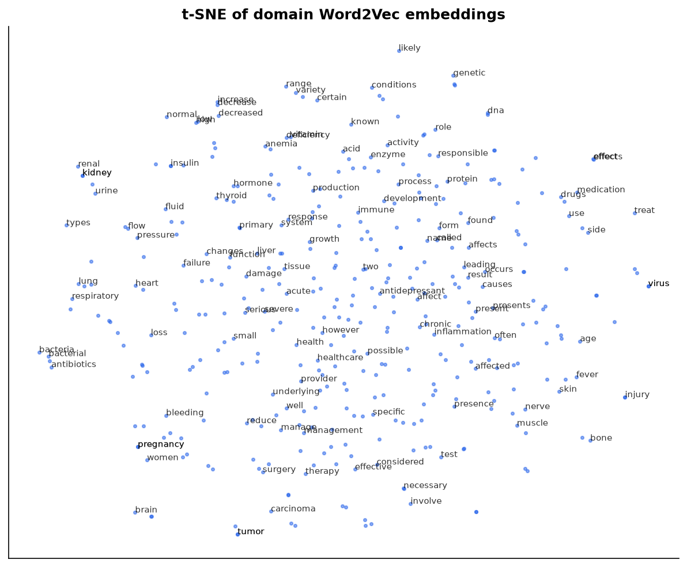
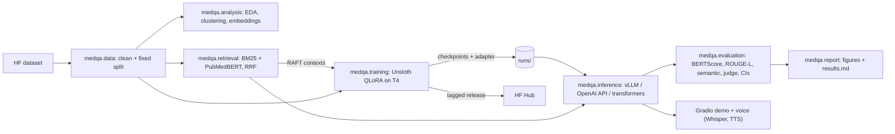

# MedQA: fine-tuning small open LLMs for medical question answering


How close can a **1-8B open model, fine-tuned on a single 16 GB T4 GPU**, get to a **frontier
model** at answering medical questions? And what do **fine-tuning, retrieval and quantization**
each contribute?

This repo turns a university NLP project (a 1,000-cell Colab notebook) into a reproducible
pipeline:

- **QLoRA fine-tuning with Unsloth**, with resumable checkpoints and principled checkpoint selection.
- **Batched serving with vLLM** and hot-swappable LoRA adapters.
- **Evaluation with bootstrap confidence intervals** and an optional LLM judge.
- **Retrieval-augmented fine-tuning (RAFT)**, with leakage controls.
- **Quantization study**: QLoRA against LoRA in training; fp16 against int8 against NF4 in inference.
- **Packaging**: one `uv` project, a CLI, tests, CI and Docker.

> **Not for clinical use.** Research and education only.

---

## Results

### Course project (2024): fine-tuning closes most of the gap



A fine-tuned **TinyLlama-1.1B went from 0.78 to 0.91 BERTScore F1**, within about 1 point of
7B models while answering about 2x faster. That finding motivates the current study with newer
models and a frontier baseline.

### Current study (2026)

| Role | Model | Params | Trained on T4 as |
|---|---|---|---|
| Frontier reference | GPT-5 (API, zero-shot) | n/a | not trained |
| Open | Llama-3.2-1B-Instruct | 1.2B | QLoRA |
| Open | **Qwen3-1.7B** (main model and ablations) | 1.7B | QLoRA / LoRA / RAFT |
| Open | SmolLM3-3B | 3.1B | QLoRA |
| Open | Qwen3-8B | 8.2B | QLoRA, served in 4-bit |

Full tables with 95% confidence intervals are generated into **[docs/results.md](docs/results.md)**
by `medqa report` after the GPU runs.

| Experiment | Question it answers | Output |
|---|---|---|
| Zero-shot against fine-tuned, 4 open models plus the frontier model | How much does domain SFT buy at each size? | `model_comparison.png` |
| Checkpoint sweep | Is the lowest validation loss the best answer quality? | `checkpoints_*.png` |
| QLoRA (4-bit) against LoRA (16-bit) | What does quantized training cost in memory, speed and quality? | `training_cost.png` |
| fp16 against int8 against NF4 inference | Memory against throughput against quality | `quant_*.png` |
| Pretrained base against instruct start | Does instruction tuning still matter after SFT? | results table |
| {base, SFT, RAFT} x {no retrieval, retrieval} | Do fine-tuning and retrieval stack? | results table |

---

## What the data looks like

33,955 flashcard QA pairs ([Medical Meadow](https://huggingface.co/datasets/medalpaca/medical_meadow_medical_flashcards)),
generated by GPT-3.5 from medical students' Anki cards. There is no context, so it's closed-book QA.
After removing exact duplicates, a fixed split holds **25,141 train / 1,676 validation / 6,704 test**.

| | |
|---|---|
|  |  |
| Answers: median 23 words, long tail to 245 | GPT-3.5 style ("may include", "typically involves") that fine-tuned models learn |
|  |  |
| TF-IDF + k-means: clear topics, but silhouette about 0.01 (heavily overlapping vocabulary) | Domain Word2Vec: *antidepressant* is next to SSRIs, SNRIs and tricyclics |

**Data caveat, measured rather than hidden.** The dataset contains many *reworded copies* of the
same card. A test question about Miller Fisher syndrome retrieves three paraphrased versions of
itself from the training set.

| Test questions whose top-3 retrieved training cards contain... | Rate |
|---|---|
| the exact reference answer | 0.7% |
| a paraphrase of it (PubMedBERT cosine ≥ 0.9) | **18.2%** |

So about 1 in 5 test questions has a near-copy in the training set. That inflates RAG gains
*and* closed-book fine-tuning scores (memorisation). The pipeline records these rates
(`data/splits_rag/stats.json`) so the effect can be separated from real generalisation.

---

## Architecture



**Engineering choices:**
- **One prompt path.** Every model (zero-shot, fine-tuned and API) goes through its own chat
  template with the same system prompt ([`prompts.py`](src/medqa/prompts.py)), so comparisons are fair.
- **One generator interface, three backends.** vLLM for GPU throughput, any OpenAI-compatible API
  for the frontier model or our own server, and transformers for exact memory measurement.
- **Validated configs.** YAML with inheritance, validated by pydantic (`extra="forbid"`, so a typo
  can't silently waste a GPU run), with `--set key=value` overrides.
- **Laptop-friendly imports.** GPU libraries are imported only inside the functions that need
  them, so the CLI, the tests and the analysis run on a Mac.
- **Reproducible figures.** Every figure is rebuilt from run artifacts (`metrics.json`,
  `trainer_state.json`), never pasted in.

---

## Quickstart

**Laptop (CPU): analysis, retrieval, tests**

```bash
git clone https://github.com/<you>/medqa-llm && cd medqa-llm
make setup-mac          # uv sync --extra analysis --extra rag --extra eval --extra demo
make test               # about 40 fast CPU tests
make analysis           # data split, EDA, clustering, embeddings -> runs/analysis/
make index              # hybrid retrieval index + RAFT splits
uv run medqa rag search "What nerve is damaged in wrist drop?"
```

**GPU (Lightning AI T4, over SSH from Cursor)**

```bash
bash scripts/lightning/setup.sh train
tmux new -s train
uv run medqa train -c configs/models/qwen3-1.7b.yaml --resume auto

bash scripts/lightning/setup.sh serve
uv run medqa checkpoints evaluate -c configs/models/qwen3-1.7b.yaml
uv run medqa evaluate -c configs/models/qwen3-1.7b.yaml --adapter auto
uv run medqa serve -c configs/models/qwen3-1.7b.yaml      # OpenAI-compatible API on :8000
uv run medqa demo --rag --voice                           # Gradio on :7860
```

Run `medqa --help` for all commands.

**Docker (NVIDIA host)**

```bash
ADAPTER_DIR=runs/qwen3-1.7b-qlora/adapter docker compose -f docker/compose.yaml up --build
```

---

## Repository layout

```
configs/          base.yaml + models/, ablations/, rag_*.yaml, frontier.yaml
src/medqa/
  data/           loading, cleaning, deterministic split, preprocessing
  analysis/       EDA, n-grams, TF-IDF clustering, Word2Vec, plotting
  retrieval/      BM25 (bm25s), dense (PubMedBERT), hybrid RRF, RAFT data builder
  training/       Unsloth SFT, checkpoint discovery/resume, merge + GGUF export
  inference/      Generator protocol; vLLM, OpenAI-compatible, transformers backends
  evaluation/     metrics + bootstrap CIs, LLM judge, runner, quantization bench, report
  voice/          Whisper STT, VITS TTS, voice assistant
  demo.py  publish.py  cli.py  config.py  prompts.py
tests/            CPU unit tests
docker/           serve (vLLM), app (Gradio), train (CUDA) images + compose
docs/             results.md (generated by `medqa report`)
reports/figures/  curated figures used in this README
notebooks/        walkthrough notebook + archived original course notebook
```

---

## Credits

Original course project (NLP, 2024) by **Alessandro Marcassa, Lorenzo Franzé, Satvik Bisht and Teka Kimbi**.
The 2026 refactor and extensions are by Satvik Bisht. The original notebook is preserved in
[`notebooks/archive/`](notebooks/archive/course_project_2024.ipynb).

Dataset: Han et al., *MedAlpaca*, 2023. Released under the [MIT License](LICENSE).
