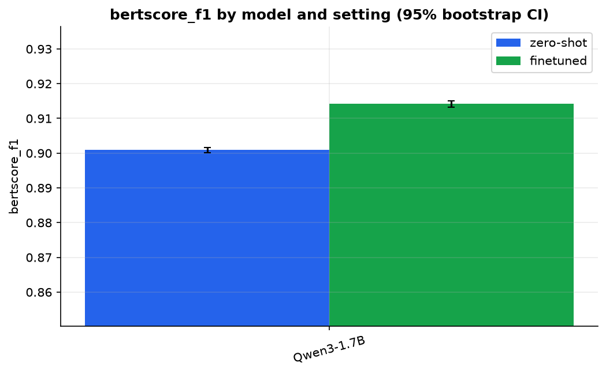

# Results

Generated by `medqa report` from `runs/*/eval/*/metrics.json`. Do not edit by hand.

## Model comparison

| Model | Setting | n | BERTScore F1 [95% CI] | ROUGE-L | Semantic cosine | Judge (1-5) | Answers/s |
|---|---|---|---|---|---|---|---|
| Qwen3-1.7B | finetuned-ckpt1200 | 6704 | 0.916 [0.915, 0.916] | 0.419 [0.413, 0.425] | 0.821 [0.818, 0.824] | - | 15.964 |
| Qwen3-1.7B | finetuned | 6704 | 0.914 [0.913, 0.915] | 0.412 [0.405, 0.417] | 0.821 [0.818, 0.824] | - | 14.653 |
| Qwen3-1.7B | zero-shot | 6704 | 0.901 [0.900, 0.902] | 0.345 [0.340, 0.349] | 0.794 [0.791, 0.797] | - | 42.704 |

## Course baseline (2024)

